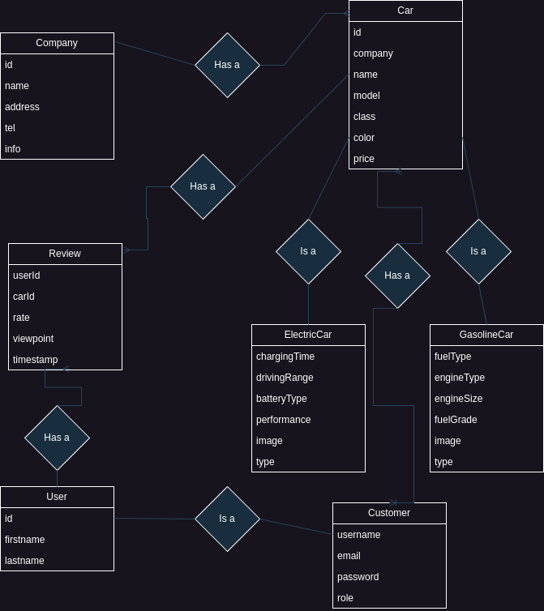

# 🚗 CarHub

> A modular car management and marketplace web application built with
> Vanilla JavaScript, Sass, Bootstrap, and HTML5.

## 🌐 Live Demo

[View Live Demo](https://smallcarshop.soorenadev.ir/)

## 📖 Overview

**CarHub** is a modular car management web application built with **Vanilla JavaScript, HTML5, Sass, and Bootstrap**.

The application provides authentication features for users, while administrators can manage cars and companies and view registered users. The project models different types of users and vehicles through a structured data model, including `User`, `Customer`, `Car`, `GasolineCar`, and `ElectricCar`.

The primary goal of this project was to strengthen my understanding of **Vanilla JavaScript and modular application architecture** before moving on to modern JavaScript frameworks such as **React**.

Rather than relying on a JavaScript framework, the project focuses on organizing a relatively complex frontend application using native JavaScript modules, separation of responsibilities, reusable functionality, and structured data relationships.

## ✨ Features

### 🔐 Authentication

* User registration (Sign Up)
* User authentication (Sign In)
* User session management

### 🚗 Car Management

* Create and manage car records
* Support for gasoline-powered vehicles
* Support for electric vehicles
* Structured vehicle data based on different car types

### 🏢 Company Management

* Add and manage companies
* Associate companies with vehicle-related data

### 👥 User Management

* View registered users
* Separate user and customer-related data

### 🧩 Modular Architecture

* Organized Vanilla JavaScript modules
* Separation of application responsibilities
* Reusable functions and components
* Structured data models and relationships

### 🎨 Responsive UI

* Responsive layouts using Bootstrap
* Custom styling with Sass
* Reusable UI styles and components

## 🏗️ Architecture

CarHub follows a **modular frontend architecture** built with Vanilla JavaScript.

The application is organized by responsibility rather than keeping all application logic in a single JavaScript file. This separation makes the codebase easier to understand, maintain, debug, and extend.

### Architecture Overview

```text
                         CarHub
                           │
             ┌─────────────┴─────────────┐
             │                           │
        Presentation                 Application
             │                        Logic Layer
             │                           │
        ┌────┴────┐              ┌───────┼───────┐
        │         │              │       │       │
        UI      Pages        Controllers Actions Services
        │         │              │       │       │
        └─────────┴──────────────┴───────┴───────┘
                           │
                     Data Layer
                           │
                 ┌─────────┼─────────┐
                 │         │         │
               Models   Database   Storage
                           │
                           │
                      Local Data
```

### Architectural Layers

#### 🎨 UI

Responsible for updating and interacting with the DOM.

The UI modules handle presentation-related tasks such as rendering data, updating elements, displaying forms, and managing visual changes.

#### 📄 Pages

Contains page-specific functionality and initialization logic.

Each page can load and coordinate the modules required for its own functionality without placing all page logic inside the main application file.

#### 🎮 Controllers

Controllers coordinate interactions between the UI, services, and application logic.

They receive user actions, call the appropriate services, and coordinate the resulting UI updates.

#### ⚡ Actions

Contains application actions triggered by user interactions.

Actions provide a clear separation between UI events and the operations that should occur as a result of those events.

#### ⚙️ Services

Contains reusable application and business logic.

Services act as an intermediate layer between controllers and the data-related modules, keeping business operations separate from DOM manipulation.

#### 🗄️ Database

Save some cars and companies in local storage.

#### 💾 Storage

Handles persistence of application data on the client side.

This layer separates storage-related operations from the rest of the application.

#### 🧩 Models

Defines the main entities used by the application.

The current domain includes:

* `User`
* `Customer`
* `Car`
* `GasolineCar`
* `ElectricCar`

The model structure allows different types of vehicles to be represented while keeping their relationships and responsibilities organized.

#### 🛠️ Utils

Contains reusable utility functions that are shared across different modules.

Keeping common functionality in utility modules reduces duplication and makes frequently used operations easier to maintain.

## 📂 Project Structure

```text
CarHub/
│
├── assets/
│   │
│   ├── css/
│   │   ├── base.scss
│   │   ├── buttons.scss
│   │   ├── cards.scss
│   │   ├── footer.scss
│   │   ├── forms.scss
│   │   ├── hero.scss
│   │   ├── login.scss
│   │   ├── navbar.scss
│   │   ├── tabs.scss
│   │   ├── utilities.scss
│   │   ├── variables.scss
│   │   ├── style.scss
│   │   └── style.css
│   │
│   ├── images/
│   │
│   └── js/
│       ├── actions/
│       ├── controller/
│       ├── database/
│       ├── models/
│       ├── pages/
│       ├── services/
│       ├── storage/
│       ├── UI/
│       └── utils/
│
├── documents/
│   └── diagram/
│
├── index.html
│
└── README.md
```

### Directory Responsibilities

| Directory               | Responsibility                               |
| ----------------------- | -------------------------------------------- |
| `assets/css/`           | Sass source files and compiled CSS           |
| `assets/images/`        | Application images and visual assets         |
| `assets/js/actions/`    | User/application actions                     |
| `assets/js/controller/` | Coordination between application layers      |
| `assets/js/database/`   | Data-related operations                      |
| `assets/js/models/`     | Application domain models                    |
| `assets/js/pages/`      | Page-specific logic                          |
| `assets/js/services/`   | Business and reusable application logic      |
| `assets/js/storage/`    | Client-side data persistence                 |
| `assets/js/UI/`         | DOM manipulation and rendering               |
| `assets/js/utils/`      | Shared utility functions                     |
| `documents/diagram/`    | Architecture and model relationship diagrams |

## 🔗 Model Relationships

CarHub uses a structured domain model to represent users, customers,
vehicles, companies, and reviews.

The following diagram illustrates the relationships between the main
entities in the application.



### Domain Model

The main entities are:

- `User` — Represents the base user information.
- `Customer` — Represents a customer account and authentication data.
- `Car` — Represents the common properties shared by vehicles.
- `ElectricCar` — Represents electric vehicles and their specific properties.
- `GasolineCar` — Represents gasoline-powered vehicles and their specific properties.
- `Company` — Represents companies associated with cars.
- `Review` — Represents customer reviews and ratings for cars.